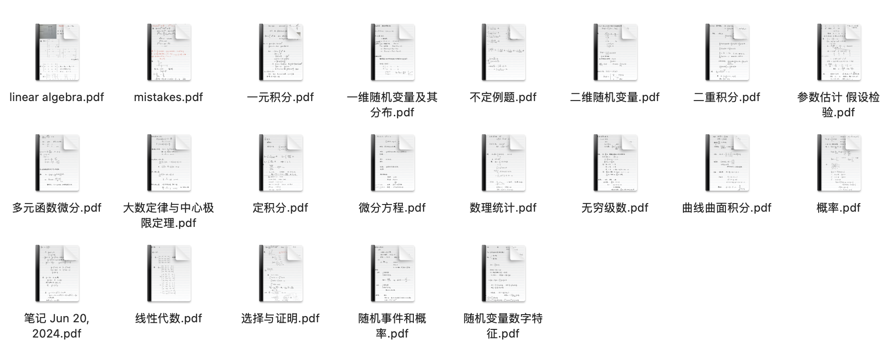
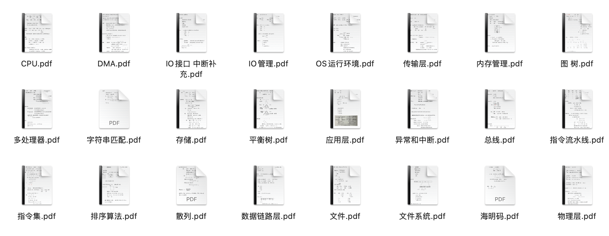

数一英一408，25考研手写笔记及经验分享。

# 笔记

通过[release](https://github.com/kingwingfly/25-11408-GEE/releases/tag/v0.0.1)页直接下载。

里面可能有macOS的`.DS_Store`文件，删了就好。

Linux `tar xvf xxx` 解压，macOS双击打开即可，Windows自力更生吧，hiahiahia.




## 目录

```text
tree
.
├── 408笔记
│   ├── CPU.pdf
│   ├── DMA.pdf
│   ├── IO接口 中断补充.pdf
│   ├── IO管理.pdf
│   ├── OS运行环境.pdf
│   ├── 传输层.pdf
│   ├── 内存管理.pdf
│   ├── 图 树.pdf
│   ├── 多处理器.pdf
│   ├── 字符串匹配.pdf
│   ├── 存储.pdf
│   ├── 平衡树.pdf
│   ├── 应用层.pdf
│   ├── 异常和中断.pdf
│   ├── 总线.pdf
│   ├── 指令流水线.pdf
│   ├── 指令集.pdf
│   ├── 排序算法.pdf
│   ├── 散列.pdf
│   ├── 数据链路层.pdf
│   ├── 文件.pdf
│   ├── 文件系统.pdf
│   ├── 海明码.pdf
│   ├── 物理层.pdf
│   ├── 目录.pdf
│   ├── 真值表转化逻辑表达式.pdf
│   ├── 磁盘和固态.pdf
│   ├── 笔记 Jul 31, 2024.pdf
│   ├── 网络层.pdf
│   ├── 虚拟机.pdf
│   ├── 计网概述.pdf
│   ├── 调度.pdf
│   ├── 进程 线程.pdf
│   └── 进程同步.pdf
├── README.md
├── images
│   ├── 408.png
│   └── math.png
├── 一点背诵
│   ├── 政治导图.pdf
│   ├── 数学公式.pdf
│   ├── 肖四（背诵提纲）.pdf
│   └── 英一作文.pdf
├── 数一真题大题
│   ├── 数一2010.pdf
│   ├── 数一2011.pdf
│   ├── 数一2012.pdf
│   ├── 数一2013.pdf
│   ├── 数一2014.pdf
│   ├── 数一2015.pdf
│   ├── 数一2016.pdf
│   ├── 数一2017.pdf
│   ├── 数一2018.pdf
│   ├── 数一2019.pdf
│   ├── 数一2020.pdf
│   ├── 数一2021.pdf
│   ├── 数一2022.pdf
│   ├── 数一2023.pdf
│   └── 数一2024.pdf
├── 数一知识
│   ├── linear algebra.pdf
│   ├── mistakes.pdf
│   ├── 一元积分.pdf
│   ├── 一维随机变量及其分布.pdf
│   ├── 不定例题.pdf
│   ├── 二维随机变量.pdf
│   ├── 二重积分.pdf
│   ├── 参数估计 假设检验.pdf
│   ├── 多元函数微分.pdf
│   ├── 大数定律与中心极限定理.pdf
│   ├── 定积分.pdf
│   ├── 微分方程.pdf
│   ├── 数理统计.pdf
│   ├── 无穷级数.pdf
│   ├── 曲线曲面积分.pdf
│   ├── 概率.pdf
│   ├── 笔记 Jun 20, 2024.pdf
│   ├── 线性代数.pdf
│   ├── 选择与证明.pdf
│   ├── 随机事件和概率.pdf
│   └── 随机变量数字特征.pdf
└── 欧几里得冲刺卷大题
    ├── 数一冲刺卷（一）例题.pdf
    ├── 数一冲刺卷（三）例题.pdf
    └── 数一冲刺卷（二）例题.pdf

7 directories, 80 files
```

# 经验分享

Todo
